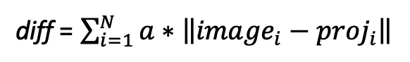

# PAC2020优化组初赛
## 题目
傅里叶空间图像相似度计算
### 简介
在冷冻电镜三维重构程序中，将二维真实图像与空间中的三维结构的投影图像的
相似度计算是调用最为频繁的计算，相似度计算的原理是真实图像与投影图像的
所有像素在傅里叶空间中的二范数之和，公式如下：  


## 要求
1. 解压源码包后，根目录下有以下文件：

- main.cpp：计算的主程序。

- input.dat：输入数据文件；K.dat：为减小输入文件体积而增加的扰动因子。不可修改！

- check.dat：标准结果输出文件，可用于验证程序的计算结果，每个数据的有效数字允许不大于十万分之一的误差。不可修改！

- Makefile：参赛队员将使用的编译器参数写入Makefile。

2. 比赛考察程序计时部分的运行时间，从数据文件读入结束开始，到结果文件输出结束终止，时间戳的位置不可修改！

3. Main.cpp中数据文件读取部分不包括在程序计时内。

4. Main.cpp中的m和K值。不可修改！

5. Main.cpp中函数logDataVSPrior的最后一行代码return result*disturb0; 不可修改！（已删，无此要求）

6. 参赛队员需要手动写出向量化SIMD优化代码。

7.  可以改变数据结构或者数据类型。

8.  如认为有必要，可以将必要的代码修改为其它语言如Fortran、汇编、intrinsic等等。

9.  为控制输入文件的体积，K次迭代都使用相同的数据文件，并加入一个扰动因子模拟每次迭代处理不同的数据，所以数据计算必须放在logDataVSPrior函数中，logDataVSPrior函数必须调用K次。利用每次迭代使用同一组数据而减少计算次数的取消成绩！

10. 有违反以上规则者，视为犯规，取消初赛成绩。

## 规则
1. 比赛成绩使用百分制。

2. 优化组比赛分为两个阶段，初赛和决赛。

3. 初赛一题，其中上机题占比90%，录音技术报告讲解占比10%；初赛成绩计入决赛总成绩（占比20%）。

4. 同一单位最多两支队伍晋级决赛。

5. 如出现优化方式/思路/源代码一致，则视为同一作品。
6. 优化代码评分按照程序的运行时间进行排名。

### 平台
1. 代码基准编译器：Intel Parallel Studio 2020 Update1

2. 平台采用 Intel® 至强®处理器。

### 作品提交
1. 优化版源代码

- 提供的源代码包含Makefile，可进行重新编译，并且能够正确生成可执行文件。

- 要求提供的源代码不涉及版权问题，大赛组委会不负责保障源代码安全。

2. 性能优化过程记录表

3. 技术报告录音PPT

提交一份时长为5分钟的录音PPT文件，包含讲解演示 PPT，代码运行结果。

4. 以上文件请使用组委会提供的模板完成后打包上传至百度云盘，链接和提取码邮件发至pac@parartera.com，邮件命名规则为报名编号-组别-单位，如: 001-优化组-并行科技。

5. 模板下载：官微底部菜单>>关于比赛>>模板下载

6. 最晚提交时间为2020年8月10日24:00


## 源码下载
https://pan.baidu.com/s/1_3xbKSR0nxRBoCNOfSpAKA  
提取码：wxyw  
## 编译与运行

```bash
make
mpirun -ppn 4 ./logVS
```
